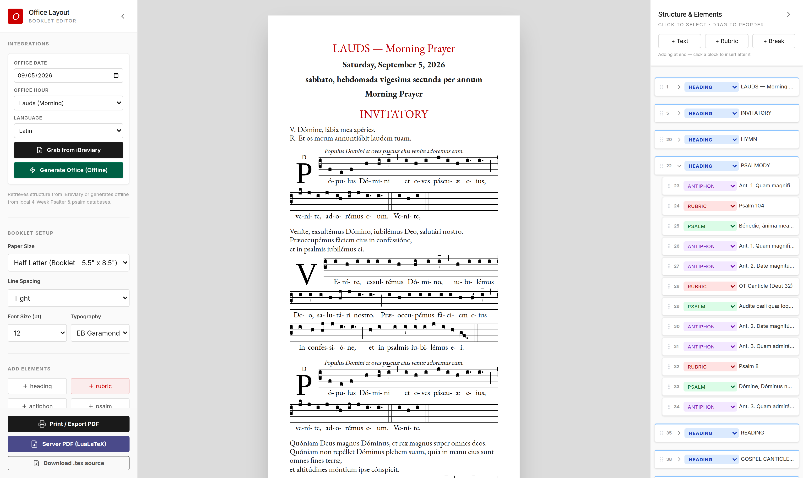
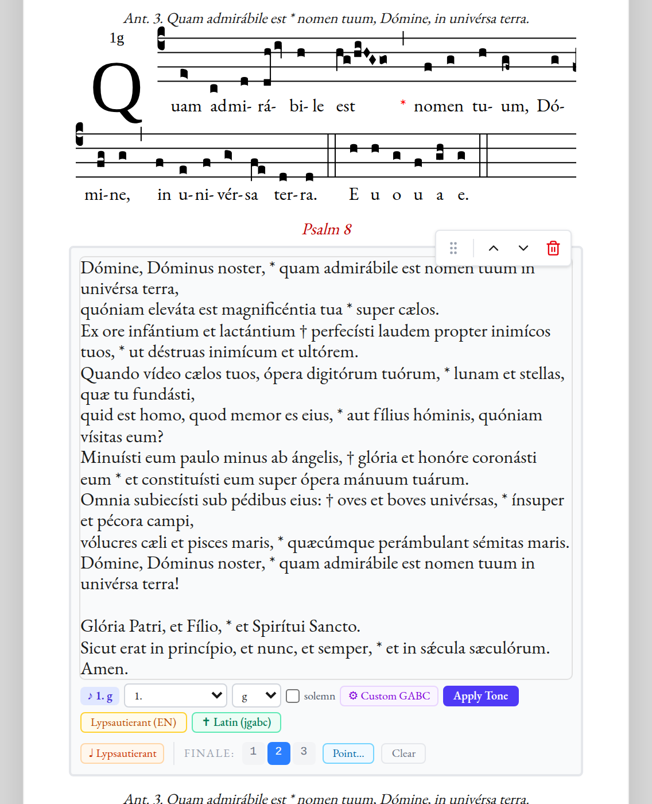
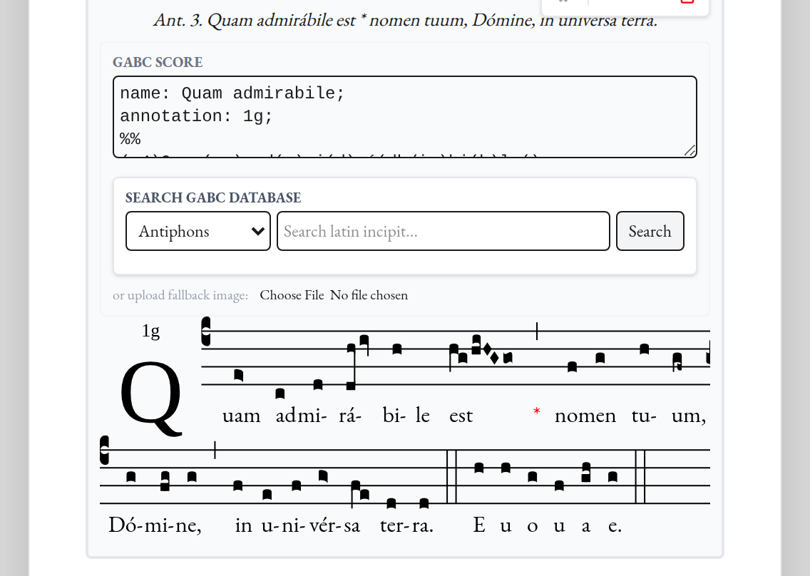
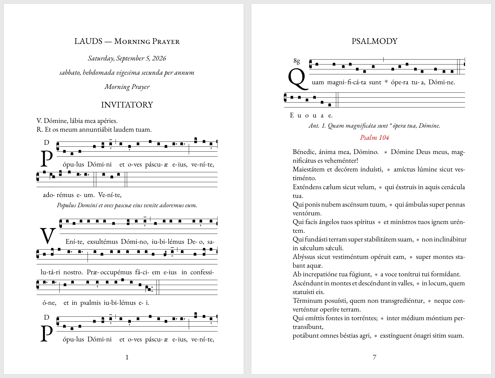

# office-designer

A layout editor for printable booklets of the **sung Divine Office**.

Pick a date and an hour; the app assembles the office, matches Gregorian chant
scores to the antiphons, hymns and invitatory, points the psalms to a tone, and
typesets the whole thing through LuaLaTeX and GregorioTeX into a booklet you can
hand to a choir.



---

## What it does

- **Builds the office for a given day** — either scraped live from
  [iBreviary](https://www.ibreviary.com/), or generated **entirely offline**
  from the psalter, calendar and chant indexes in this repository.
- **Finds the chant.** Antiphons, hymns, invitatories and responsories are
  looked up by Ordo Cantus Officii reference in a local GregoBase extract of
  18,522 scores, and rendered as live notation in the browser (Exsurge) and as
  real GregorioTeX in the PDF. Anything it cannot find, you can search for by
  incipit or paste in as GABC.
- **Points the psalms.** Three independent pointing engines mark accents,
  preparatory syllables, flexes and mediants for a chosen tone — in Latin or
  English. The tone is inherited automatically from the mode of the antiphon
  that precedes the psalm.
- **Everything stays editable.** Every element of the office is a block: reword
  it in place, change what kind of block it is (heading → rubric → antiphon…),
  drag it into a new position, delete it, or break the page after it.
- **Exports** a half-letter or A5 booklet as a LuaLaTeX-rendered PDF, as the
  `.tex` source, or through the browser's own print dialog.

### Pointing a psalm

Select a psalm and its toolbar appears. The `♪ 1. g` chip is the tone taken
from the antiphon above it (mode 1, termination *g*); *Apply Tone* re-points the
text, and the second and third rows switch text source and pointing engine.



#### Correcting the stresses, once

The *+/− stress aware* engines sing from acute accents, and the office texts
arrive without them: `accentuateEnglish` supplies them from the psalters' own
pointing and gets about 92% of words right. *Review word stresses* opens the
rest for correction — click a syllable to move the accent, click it again to
unaccent the word and let the cadence pass over it.

**Save these accents** keeps the correction, so it is made once:

- the corrected text is kept whole and matched by its own words, so the psalm
  comes back accented when it next comes round on the four-week cycle;
- a word whose accent was *moved* also teaches the word list, so the same word
  is accented right in psalms never opened. Unaccenting teaches it nothing —
  a cadence passing over "God" in one line says nothing about "God" elsewhere.

Both live in `data/accent-corrections.json`, in the repository: it is editorial
work, and belongs where it can be read and diffed. *Forget saved accents* drops
the text; the corrected words stay.

### Chant scores

Each antiphon carries its GABC source. Edit it in place, search the local
database by incipit, or upload an image as a fallback; the score below re-renders
as you type.



### The PDF it produces

`Server PDF (LuaLaTeX)` renders the same document through GregorioTeX — real
square notation, EB Garamond, red rubrics, pointed psalm verses.



---

## Quick start

### Requirements

| Need | Why |
|---|---|
| **Node.js 22** | the scripts rely on Node's native TypeScript stripping |
| **`lualatex`** | TeX Live — `texlive-luatex` or `texlive-full` |
| **`gregorio`** + the **`gregoriotex`** LaTeX package | `texlive-music`, or from CTAN |
| `perl`, `sed` | `scripts/verify-lypsautierant.sh` only |

The two binary paths are hard-coded in [lib/latex/process.ts](lib/latex/process.ts)
as `/usr/bin/lualatex` and `/usr/local/bin/gregorio`. `GET /api/pdf` reports the
version of each, or the error if one is missing — check there first when an
export fails.

On Debian/Ubuntu:

```bash
sudo apt-get install texlive-luatex texlive-fonts-recommended \
     texlive-lang-latin texlive-music
```

### Install and run

```bash
git clone https://github.com/frfrancisgv-cell/office-designer.git
cd office-designer
npm install
npm run dev            # http://localhost:3000
```

Or under PM2, the way it runs in production — port 4001, see
[ecosystem.config.js](ecosystem.config.js):

```bash
npx next build && pm2 start ecosystem.config.js
```

No API keys, no accounts, no submodule step. The psalter text the app serves,
and the perl and sed the tests compare against, are vendored in
[vendor/psautier/](vendor/psautier/) — see
[vendor/psautier/VENDORED.md](vendor/psautier/VENDORED.md) for what is there and
why. See [.env.example](.env.example) for the two optional variables.

`lypsautierant/` is a submodule pointing at the same sources upstream, kept for
their full history, the LilyPond scores, the fonts and the psalter-book build
machinery. The app never reads it, so clone it only if you need those:
`git submodule update --init`.

---

## Using it

1. **Choose the day.** Date, hour (Matins through Compline) and language in the
   left sidebar. Offline generation does not accept Matins yet — see
   [Status](#status).
2. **Fill the booklet.** *Grab from iBreviary* scrapes the day's office —
   English, Latin, Italian, French or Spanish — and enriches it with chant. Or
   *Generate Office (Offline)* builds it from local data with no network at all.
   Where iBreviary offers alternatives for the day, an **Occasion** dropdown
   appears; changing it re-fetches.
3. **Set the page.** Paper size (Half Letter and A5 are the booklet sizes),
   line spacing, base font size, EB Garamond or Inter.
4. **Edit.** Click any block to edit its text in place. The right sidebar is the
   document outline: click to jump, drag to reorder, change a block's type from
   its dropdown, collapse a whole section, or move and delete a section at once.
   *+ Text*, *+ Rubric* and *+ Break* insert after the selected block.
5. **Point the psalms.** Select a psalm: choose a tone and termination, tick
   *solemn* for a solemn mediant (the default on the gospel canticles), and
   press *Apply Tone*. `Lypsautierant (EN)` and `✝ Latin (jgabc)` swap in a
   different text for the same psalm; `♩ Lypsautierant` points with the psautier
   rules instead; *Finale 1/2/3* is the naive client-side fallback.
6. **Fix the chant.** On an antiphon or hymn, edit the GABC directly, search the
   database by Latin incipit, or upload an image if no score exists.
7. **Export.** *Server PDF (LuaLaTeX)* for the real thing, *Download .tex
   source* to typeset it yourself, *Print / Export PDF* for the browser's own
   rendering. A failed LaTeX run shows the log inline.

---

## Where the texts and the chant come from

Two independent paths produce the same kind of `Block[]` document:

| | **iBreviary** (`/api/ibreviary`) | **Offline** (`/api/liturgy`) |
|---|---|---|
| Needs network | yes | no |
| Text | scraped from iBreviary, five languages | local psalters and Latin books |
| Calendar | iBreviary's own | [romcal](https://github.com/romcal/romcal), US calendar |
| Psalm assignment | as published | Ordo Cantus Officii + the four-week psalter schema |
| Chant | OCO-referenced GregoBase lookup | the same lookup |
| Best at | any day, any language | **Latin** — see [Status](#status) |

The data on disk:

| Path | What |
|---|---|
| `IDX_ANT.csv` | 2,813 antiphons indexed by OCO occasion code |
| `IDX_INV.csv`, `IDX_RB.csv` | invitatory antiphons (78) and responsories (210) |
| `OCO/` | the Ordo Cantus Officii itself, plus the hymn index (353 hymns) |
| `gregobase-cache.json` | 18,522 GABC scores, extracted from `gregobase_online.sql` |
| `jgabc-psalms/` | Latin psalm texts (Nova Vulgata) |
| `vendor/psautier/` | the Revised Grail Psalter and the Abbey Psalms and Canticles, and the perl/sed pointing rules |
| `lib/liturgy/data/` | the four-week psalter schema and the hymn table |
| `data/accent-corrections.json` | psalm stresses corrected by hand in the editor, kept |

### The three pointing engines

They coexist deliberately, and are chosen per block in the UI:

- **`psalm-tone-engine.ts`** — GABC-driven. Counts accents and preparatory
  syllables in a tone's GABC string and marks the text to match. Serves
  `/api/psalm-tone` (*Apply Tone*). The tone catalogue in `tone-data.ts` covers
  tones 1–8 with their terminations and solemn mediants, *tonus peregrinus*,
  *in directum*, the monastic and *antiquo* variants, the introit tones and the
  versicle tones.
- **`lypsautierant-engine.ts`** — a TypeScript port of the perl and sed rules
  under `vendor/psautier/`. Serves `/api/lypsautierant`. Verified line-for-line
  against the perl original on every psalm in the corpus.
- **`components/psalm-utils.ts`** (`autoPointPsalm`) — a naive client-side
  fallback, reached only through the explicit Finale 1/2/3 buttons.

---

## HTTP API

| Route | Purpose |
|---|---|
| `GET /api/ibreviary?date&hour&lang[&occasionOverride]` | scrape and enrich a day's office |
| `GET /api/liturgy?date&hour&lang[&collection][&psalterWeek]` | build the same office offline |
| `GET /api/ibreviary/gabc-search?q&type` | search the chant database by incipit |
| `GET /api/psalm-text?psalm=N` (or `ot=N`, `nt=N`) | one psalm or canticle, Latin or English |
| `POST /api/psalm-tone` | point text to a tone (`{action:'point', text, tone, variant, lang, solemn}`) |
| `POST /api/lypsautierant` | point text with the psautier rules (`{action:'point', text, family, mode, variation}`) |
| `POST /api/pdf` | `{blocks, settings}` → PDF; `?format=tex` returns the source bundle |
| `GET /api/pdf` | dependency check: `lualatex` and `gregorio` versions |
| `GET /api/accents` · `POST /api/accents` | the saved accent corrections; `{action:'save', accents, label?}` keeps a corrected psalm and learns its moved accents, `{action:'forget', text}` drops one |
| `POST /api/share` · `GET /api/share?id=` | store a document under `/tmp/office-shares`, 30-day expiry, readable at `/share/<id>` (not yet wired into the editor) |

---

## Project layout

| Path | What |
|---|---|
| `app/` | Next.js app router; the editor page and every API route |
| `components/` | the editor UI — `office-editor.tsx` is the root, `BlockEditor.tsx` one block |
| `hooks/` | document state (`useOfficeBlocks`), pointing (`useBlockPointing`), saved accents (`useAccentCorrections`) |
| `lib/latex/` | `renderer.ts` builds the .tex; `process.ts` runs gregorio and lualatex |
| `lib/psalm-tones/` | the three pointing engines and the tone catalogue |
| `lib/liturgy/` | offline office construction, for `/api/liturgy` |
| `app/api/ibreviary/` | the scraper, and the OCO → GregoBase chant lookup |
| `scripts/` | data generation, the verifiers, the test resolver hook |
| `docs/screenshots/` | the images in this README |

[Guide.md](Guide.md) is the engineering guide to the iBreviary scraper and the
OCO alignment — read it before touching `app/api/ibreviary/`.

---

## Development

```bash
npm run dev                          # next dev
npm run build                        # next build
npm run lint                         # eslint .
npm test                             # unit + lypsautierant + latin syllabification
npm run test:unit                    # just the unit tests (~1s)
npm run test:lyps                    # just verify-lypsautierant.sh (~1 min)
npm run test:latin                   # just verify-latin-syllabify.mjs
npm run check:hymns                  # cross-check OCO/INDEX_HYM2.{json,tex}
node scripts/gen-lypsautierant.mjs   # regenerate lypsautierant-{syllabify,modes}.ts
node scripts/build-gabc-cache.mjs    # rebuild gregobase-cache.json from the .sql
```

**Both `lypsautierant-syllabify.ts` and `lypsautierant-modes.ts` are generated**
— edit `scripts/gen-lypsautierant.mjs` instead.

### Tests

`npm test` runs all three suites, and all three must pass.

`verify-lypsautierant.sh` is the heavy one: it runs every psalm in the corpus
(11,823 lines, 259 files) through both the perl original and the TypeScript port
and requires them to agree, line for line. It must pass before any change to
`lib/psalm-tones/lypsautierant-*.ts` lands.

The unit tests are `lib/**/*.test.ts` and `app/**/*.test.ts`, run by
`node --test`. Node 22 strips the types natively, so there is no build step and
no test framework to install; `scripts/ts-resolve.mjs` (installed by
`scripts/test-register.mjs`) supplies the two things plain Node does not know —
extensionless imports and the `@/*` alias — which Next.js otherwise provides at
build time.

They cover the places where a silent wrong answer is expensive and easy to make:
`escLtx` (an unescaped character kills the whole PDF), `hebrewToVulgate` (a wrong
number reads the wrong psalm, or none), and `stripPointing` (a bad strip corrupts
the text the user is editing, and compounds on every re-point). Import a module
from a test and it must be importable outside Next, which is why `lib/` imports
types with `import type`.

---

## Status

The app is used in earnest for Latin booklets; the English side is limited by
what is publishable, not by what is coded.

- **Offline Latin** — Lauds, Vespers, Compline and the minor hours come out
  whole: psalms, canticles, antiphons, hymns, invitatory and collect, all with
  chant. This is the part the app is best at, and the part no transition to a
  new English edition can disturb.
- **Offline English** — the psalms and canticles are complete and accented, but
  the antiphons and hymns still come out as placeholders (`Ant. 1: Psalm 110`,
  `III p. @ordinaryTime:thirdHymn`). The English propers of the second-edition
  *Liturgy of the Hours* are not published in a form this repository can carry.
  Use iBreviary for English until they are.
- **Office of Readings, offline** — the psalmody is assembled, but the two
  readings and their responsories are emitted as bracketed placeholders, and the
  psalm selection does not yet follow the day.
- **Known bug** — the left sidebar's *Matins / Readings* option sends
  `hour=matins`, which `/api/liturgy` rejects (`unsupported hour: matins`); the
  hour it accepts is `readings`. Offline Matins therefore errors from the UI
  today. iBreviary handles that hour fine.
- **Not built, deliberately** — psalm prayers and intercessions.
- **Sharing** exists as an API and a read-only page but has no button in the
  editor yet.

## Sources and their terms

The code here is one thing; the books it reads are another. The chant comes from
[GregoBase](https://gregobase.selapa.net/), the Latin psalms from the Nova
Vulgata, the English from the Revised Grail Psalter and the Abbey Psalms and
Canticles by way of
[lypsautierant](https://github.com/frfrancisgv-cell/lypsautierant), and the
antiphon assignments from the Ordo Cantus Officii. The rights in those texts
belong to their publishers, and the *Liturgia Horarum* typical edition is
deliberately **not** in this repository for that reason — it is read locally by
the extraction scripts and excluded in [.gitignore](.gitignore). Check the terms
before redistributing anything you generate.

### Psalm Tone Creator

Select a psalm, then open **Pointing → Psalm Tone Creator**. Choose **New tone
from this psalm** to prepare syllable models for the mediant, ending, and flex.
Edit each cadence before saving the tone.

- **Lypsautierant + − =** places marks under individual syllables. Patterns can
  count from the final syllable or follow the final accented syllable. For an
  accent pattern, select its anchor with the radio button under the model text.
  These rules execute through the existing TypeScript Lypsautierant port; the
  Creator does not require or invoke an external `perl/model.pl`.
- **jgabc chant notation** lets you click a four-line staff (or use arrow keys)
  to choose a pitch above each syllable. The note field also accepts multiple
  pitches, a–m, for a neume. Choose reciting, fixed, and accent roles to distinguish
  the tenor from the cadence. Repeated recitation collapses into an open note;
  an open note after each accent allows the formula to accommodate different
  numbers of unstressed syllables.

The formula box updates immediately and the whole-psalm preview follows each
edit. **Save tone** keeps the named examples in `data/created-tones.json`;
**Saved tones** makes them available on every other psalm. **Use on this psalm**
applies the preview and embeds the tone definition in the office so it travels
with saved/shared offices. Saving a tone alone does not change the psalm.

Inference follows the explicit roles and anchors in the model; it does not infer
all possible exceptional cadences from a single verse. Marks outside a short
line are omitted. The two notation modes retain their own marks and pitches:
plus/minus pointing alone cannot determine an absolute chant melody. English
stress comes from the existing accentuation system; correct the psalm's accents
before preparing a model when necessary.
